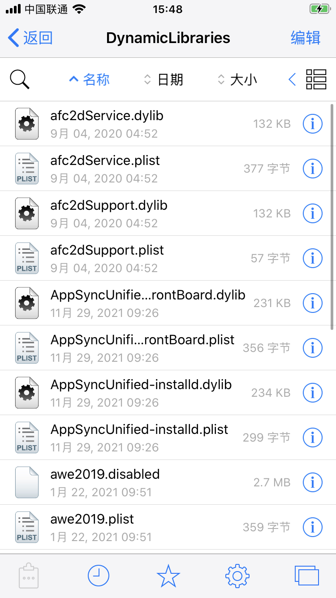

# tweak插件

关于tweak的详细介绍：

* tweak
  * 是什么：a dynamic library
    * all kinds of crack patches
  * 叫法：tweak=插件=extension=扩展
  * 原理：
    * 通过一个预定义的过滤器，被注入到特定的程序中，实现替代特定的Objective-C或Swift的方法函数，从而实现特定功能
    * 底层基于：Cydia Substrate
      * 详见：【已解决】iOS中Cydia Substrate
  * 相关背景
    * iOS有2中dynamic library
      * dylib
        * 举例
          * libsqlite.dylib, libz.dylib等
      * framework
    * 现状
      * （iOS的）开发者用framework的比较多
      * 越狱插件Tweak开发：主要用dylib
  * tweak的位置
    * /Library/MobileSubstrate/DynamicLibraries
      * 存放了多种文件
        * dylib
        * plist：定义插件的hook的范围
        * bundle：插件的资源文件
      * 截图举例
        * 
  * 发布
    * 2种方式
      * deb包：只能在越狱后的iOS（iPhone）中安装
      * ipa包：用（开发者自己的 或 企业）证书，把代码编译封装到ipa包，然后去安装到iOS(iPhone)中
        * 当然也有不小的限制，但是支持普通非越狱手机
* 越狱开发=jailbreak development= development of a Tweak=开发一个插件=插件开发
* Theos
  * Theos is a little tool which helps you with all the application creation and compilation.
