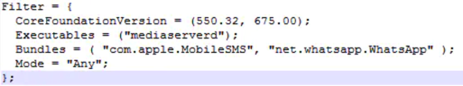

# CydiaSubstrate

* `CydiaSubstrate`=`Cydia Substrate` = `Cydia Mobile Substrate`
  * 旧称：`MobileSubstrate`
  * 概述：Cydia中的hook框架
    * The powerful code modification platform behind Cydia
    * Powerful Code Insertion Platform
    * a framework and development library
      * used by developers to reasonably sanely (and hopefully safely) make modifications to code written by other developers and running in other processes, even if multiple people are attempting to modify the same thing; this library is the foundation of most of the interesting hacks found on the iPhone.
  * 额外说明
    * `MobileSubstrate`是`Cydia`实现的基础
      * 现有的越狱开发环境一般使用的是 [Theos/Logos](../../tweak_dev/theos_logos/README.md) 或者 [iOSOpenDev](../../tweak_dev/iosopendev.md)
        * 这两者hook功能都是对MobileSubstrate API的封装
  * 反破解
    * `MobileSubstrate`是基于`DYLD_INSERT_LIBRARIES`方式实现的
      * 有些应用（如美团）为了阻止他人的破解，采用了一些措施阻止了DYLD_INSERT_LIBRARIES这种注入方式
        * 核心：加编译参数，Restricted Segment of Header 禁止改动加载的库
          * `-Wl,-sectcreate,__RESTRICT,__restrict,/dev/null`
        * 最新情况
          * 新版dyld早已废弃此种手段了
            * 从iOS10开始，这种防护手段已失效
  * 功能
    * 允许实时修改代码
      * 第三方开发者调用其API，可以实现给IOS系统打补丁，改变系统或者应用的运行行为。
      * Substrate makes it easy to modify software, even without the source code, and in a way that allows users to easily choose which changes they want
  * 机制=原理
    * injection mechanism 注入机制
    * 自己写插件=扩展=substrate extensions，利用API，实现特定功能
      * Developers support this by building their changes as "substrate extensions" that are loaded into all of the processes they want to take control of.
      * By using the provided API to make all changes in memory, multiple developers can safely adapt the same parts of the target program to their purposes.
    * 实现原理
      * 在MAC与IOS平台上，动态库的后缀一般是dylid，而加载这些动态库的程序叫做
        * dynamic linker=dynamic loader=dyld
      * 这个程序有很多的环境变量来设置程序的一些行为，最为常用的一个环境变量叫做
        * DYLD_INSERT_LIBRARIES
      * 它是一个使用冒号分隔的动态库路径字符串，表示一个将要加载运行的动态库额外依赖的其它动态库
      * 通过这个环境变量，我们就可以向应用中注入自己的动态库，进而改变应用运行时的特定行为
      * 而这种方式，也正是mobileSubstrate所使用的最基本方法
  * Cydia Substrate extensions
    * =run-time patches
  * 主要模块
    * MobileHooker
      * used to replace system functions
        * This process is known as hooking
      * 核心函数API
        * MSHookMessage
          * 非线程安全
          * 用于替换原函数实现
          * 在OC的Runtime机制上实现的
        * MSHookMessageEx
          * 线程安全
          * 用于 hook Objective-C 方法
            * 在OC的Runtime机制上实现的
        * MSHookFunction
          * 用于 hook C 语言函数
            * 主要用于C/C++函数
          * 与OC不同，它另有一套自己的实现方式
        * 非公开的：MSHookProcess
    * MobileLoader
      * loads 3rd-party patching code into the running application
        * 将指定目录下的补丁文件（动态库文件）加载到指定的程序中
      * `/Library/MobileSubstrate/DynamicLibraries/`
      * 举例
        * 
    * Safe mode
      * 容错处理
      * 第三方开发者通过MobileSubstrate向系统注入自定义代码时，如果考虑不周就可能导致终端设备处于崩溃的状态。MobileLoader会捕获这个崩溃异常，然后让设备进入SafeMode状态，在这个状态下，所有的第三方补丁都将被禁用，开发者可以比较从容的恢复设备。
      * 注入别的进程并改变其逻辑一定存在风险，难免会造成程序崩溃的现象，如果崩溃的是SpringBoard等系统进程，则会造成系统瘫痪。为了避免这类情况，SafeMode会捕获SIGABRT、SIGILL、SIGBUS、SIGSEGV、SIGSYS这几种信号，捕获到目标信号后SafeMode会使设备进入安全模式，在安全模式下所有第三方插件(即dylib)都会被禁用，便于修复系统
      * When a extension crashed the SpringBoard, MobileLoader will catch that and put the device into safe mode
      * In safe mode all 3rd-party extensions will be disabled.
      * The following signals will invoke safe mode
        * SIGABRT
        * SIGILL
        * SIGBUS
        * SIGSEGV
        * SIGSYS
  * iOS
    * 前提：
      * iOS设备已越狱
      * 已安装Cydia = Cydia Installer
    * 安装：通过Cydia安装
      * Cydia Substrate · Cydia (saurik.com)
        * https://cydia.saurik.com/package/mobilesubstrate/
  * 安卓
    * 包名：com.saurik.substrate
    * apk
      * http://www.cydiasubstrate.com/download/com.saurik.substrate.apk
  * 资料
    * 官网 Cydia Substrate
      * http://www.cydiasubstrate.com/
    * 快速上手 [Getting Started](http://www.cydiasubstrate.com/id/264d6581-a762-4343-9605-729ef12ff0af/)
    * 常见问题 [FAQ | Cydia Substrate](http://www.cydiasubstrate.com/id/1842c585-50e3-4964-8a0d-2f69762767d7/)
      * Why are the APIs namespaced with "MS”? FAQ | Cydia Substrate
        * API前缀：MS = MobileSubstrate
          * 最早时：Mobile指的是MobileSafari, MobileMail等
  * 相关
    * The iPhone Wiki
      * https://www.theiphonewiki.com/
        * The iPhone Wiki is an unofficial wiki dedicated to collecting, storing and providing information on the internals of Apple's amazing iDevices
        * We hope to pass this information on to the next generation of hackers so that they can go forth into their forebears' footsteps and break the ridiculous bonds Apple has put on their amazing mobile devices.
      * 越狱Jailbreak
        * https://www.theiphonewiki.com/wiki/Jailbreak
    * 类似框架
      * Cycript
