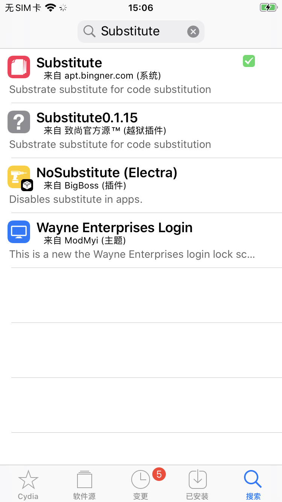
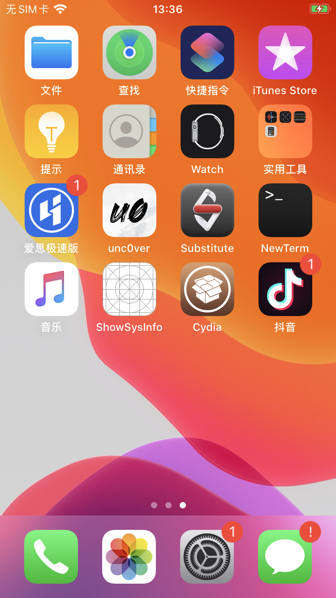
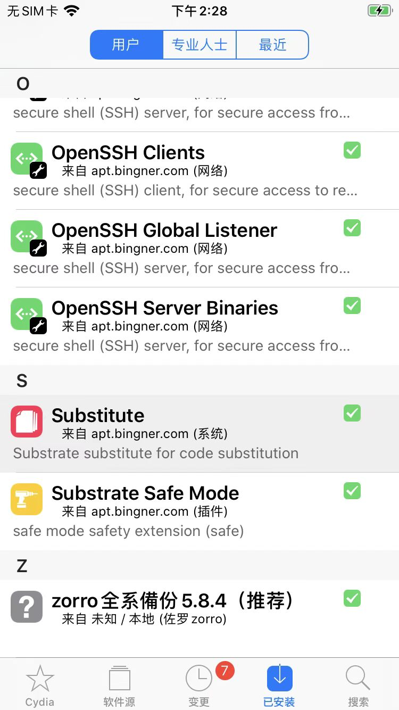

# Substitute

* Substitute
  * 是什么：一个插件注入系统
    * 和Substrate（==CydiaSubstrate）类似
      * 是Substrate的替代品
  * 用途
    * 可以基于Substitute的API函数，开发插件，实现各种hook
  * Substitute的函数
    * API函数
      * 包含
        * `SubGetImageByName`
        * `SubFindSymbol`
        * `SubHookFunction`
        * `SubHookMessageEx`
      * （好像分别）对应着 [CydiaSubstrate](../../jb_tweak_basic/tweak_dev_method/cydiasubstrate.md) 的
        * `MSGetImageByName`
        * `MSFindSymbol`
        * `MSHookFunction`
        * `MSHookMessageEx`
    * 其他底层函数
      * [substitute.h](https://github.com/comex/substitute/blob/master/lib/substitute.h)
        * `substitute_open_image`
        * `substitute_close_image`
        * `substitute_find_private_syms`
        * `substitute_sym_to_ptr`
        * `substitute_interpose_imports`
        * `substitute_hook_objc_message`
        * `substitute_free_created_imp`
  * 作者：Comex
  * 官网
    * 没有官网，只有GitHub
      * [comex/substitute: A free runtime modification library. (github.com)](https://github.com/comex/substitute)
        * 但是：作者已放弃维护了
      * 其他人的fork后的
        * [MidnightTeam/substitute: A free runtime modification library. (github.com)](https://github.com/MidnightTeam/substitute)
  * 下载
    * 只能网上找到其他地方去下载
      * [Package: Substitute • com.ex.substitute • Bingn... (ios-repo-updates.com)](https://www.ios-repo-updates.com/repository/bingner-elucubratus/package/com.ex.substitute/)
        * 2.2.3版本
          * https://apt.bingner.com/debs/1443.00/com.ex.substitute_2.2.3_iphoneos-arm.deb
    * 或者从Cydia中搜：Substitute，可以找到并安装对应插件
      * 
  * 对应现象
    * 用unc0ver越狱后，会自动安装
      * Substitute的app：桌面上可以看到Substitute的图标
        * 
      * Substitute的插件
        * Cydia中可以看到Substitute插件
          * 
