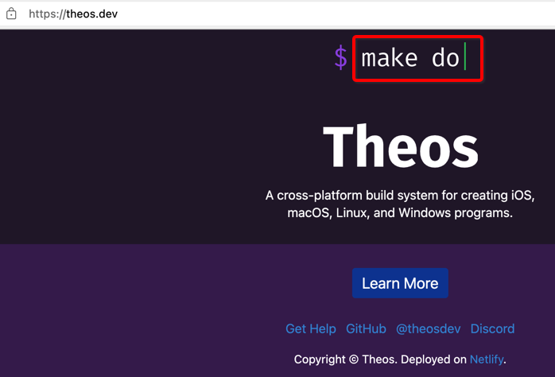
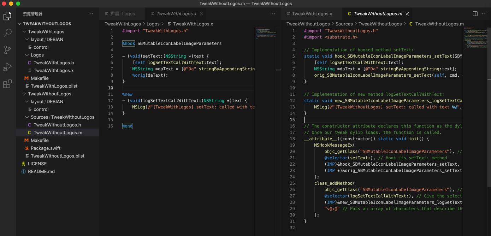

# Theos/Logos

TODO：

* 【整理】iOS越狱插件开发工具：theos
* 【已解决】Mac中theos的tweak的编译并安装到iPhone
* 【已解决】Mac中theos的make install报错：ssh connect to host port 22 Connection refused
* 【已解决】Mac中初始化和安装Theos开发环境
* 【未解决】越狱iOS如何用Theos开发带GUI图形界面的插件
* 【已解决】Mac中用theos开发最简单的插件的demo：加锁屏左上角加红色框
* 【已解决】theos中确认%log的syslog系统日志是否生效
* 【无法解决】iPhone6中iOS的tweak插件hook更新系统参数不生效
* 【整理】iOS中的Frameworks框架
* 【已解决】Mac中theos用模板创建项目代码并更改代码
* 【已解决】iOS的tweak的Logos代码报错：%orig requires arguments when hooking variadic functions
* 【已解决】iOS越狱插件开发中%hookf和MSHookFunction的关系

* 【未解决】越狱iOS如何用Theos开发带GUI图形界面的插件
* 【记录】学习Theos的文档内容：theos-ref仓库
* 【已解决】Mac中theos用模板创建项目代码并更改代码
* 【已解决】Mac中theos的tweak的编译并安装到iPhone
* 【无法解决】iPhone6中iOS的tweak插件hook更新系统参数不生效
* 【已解决】Mac中用theos开发最简单的插件的demo：加锁屏左上角加红色框
* 【已解决】用XCode开发一个Objective-C的iOS的带GUI的app供配合测试theos修改系统参数是否生效
* 【已解决】用Objective-C的iOS的app作为theos开发的tweak插件去hook修改iPhone6的系统参数
* 
* 【整理】iOS越狱插件开发工具：MonkeyDev

* [iOS Tweak进阶 – 六阿哥博客 (6ag.cn)](https://blog.6ag.cn/3414.html)
  * 好好学习该贴，有很多有价值的内容值得学习
    * 比如：logify.pl的用法

---

## Theos概述

* Theos
  * 概述：一个跨平台（交叉编译）开发工具套装，用于不用XCode的情况下，开发iOS程序
    * a cross-platform suite of development tools for managing, developing, and deploying iOS software without the use of Xcode
  * 用途：
    * 主要用于越狱后的iOS的扩展插件的开发
      * It is an important tool for people building extensions (tweaks) for jailbroken iOS; most extension developers use Theos.
  * 包含组件
    * project templating system：NIC
      * creates ready-to-build empty projects for varying purposes
    * robust build system driven by GNU Make
      * capable of directly creating .deb packages for distribution in Cydia
    * Logos, a built-in preprocessor-based library of directives = an Objective-C preprocessor 
      * designed to make MobileSubstrate extension development easy
  * 其他说明
    * Theos is primarily used for jailbreak-centric iOS development (such as MobileSubstrate extensions, PreferenceLoader bundles, and applications intended for distribution in Cydia), but can be used for other types of projects as well.
    * This can be helpful for someone wishing to develop an iPhone SDK-based application without using Mac OS X or Xcode to do so, as Theos can be used on Linux and iOS as well
  * 资料
    * GitHub
      * theos/theos: A cross-platform suite of tools for building and deploying software for iOS and other platforms. (github.com)
        * https://github.com/theos/theos.git
      * Wiki
        * 主页
          * [Home · theos/theos Wiki (github.com)](https://theos.dev/docs/)
        * 安装
          * [Installation · theos/theos Wiki (github.com)](https://theos.dev/docs/installation)
    * iphonedev.wiki
      * [Theos - iPhone Development Wiki](https://iphonedev.wiki/index.php/Theos)
* Logos
  * 是什么：Theos开发套件的一个组件，通过一系列预处理指令，实现了写hook方法更简单和简洁
    * Logos is a component of the Theos development suite that allows method hooking code to be written easily and clearly, using a set of special preprocessor directives
  * 概述
    * The syntax provided by Logos greatly simplifies the development of MobileSubstrate extensions ("tweaks") which can hook other methods throughout the OS
      * In this context, "method hooking" refers to a technique used to replace or modify methods of classes found in other applications on the OS
  * Logos的指令directives
    * Block level
      * `%group`
      * `%hook`
      * `%new`
      * `%subclass`
      * `%property`
      * `%end`
    * Top level
      * `%config`
        * Configuration Flags
      * `%hookf`
      * `%ctor`
      * `%dtor`
    * Function level
      * `%init`
      * `%class`
      * `%c`
      * `%orig`
      * `%log`
* Logify
  * 是什么：Theos的一个模块
  * 功能：
    * 输入：`.h`头文件
    * 输出：`.xm`文件
      * `.xm` = MobileSubstrate扩展
      * 输出log日志：当被调用时
  * 目的：帮助hook开发者调试和查看哪些函数被调用了
  * 用法举例
    * logify.pl SomeClassHeader.h > tweak.xm
* NIC=New Instance Creator
  * 叫法：
    * 你也可以称其为：Nicolas
  * 是什么：It provides a way to create projects (“instances”) based on templates.
    * Theos comes with a handful of useful templates and others are available from various developers in the community.
  * 文档
    * [New Instance Creator (NIC) · Theos](https://theos.dev/docs/nic)
    * [NIC - iPhone Development Wiki](http://iphonedevwiki.net/index.php/NIC)
    * 

## 搭建theos开发环境

前提：

* Mac
  * Homebrew
  * XCode
    * XCode是必须的，因为Command Line Tools是不够用的。而Xcode包含了所有Apple平台的所有工具（链）

（1）确保Mac中已安装XCode
（2）安装必要的工具：
* ldid
* xz
    ```bash
    brew install ldid xz
    ```
（3）设置theos的环境变量

先确认自己的shell是啥：

```bash
➜  iOS_Tweak echo $SHELL
/bin/zsh
```
此处是：`zsh`

所以去编辑`zsh`的启动脚本：

```bash
vi ~/.zshrc
```

加上：

```bash
export THEOS=/opt/theos
export PATH=$THEOS/bin:$PATH
```

注：
（1）安装位置的选择
为了后续兼容其他相关开发工具，比如iOSOpenDev
* 最好安装到默认的=大家常用的位置
  * /opt/theos
* 最好不要放在其他位置
  * 比如我之前就放在自己的某个目录
    * /Users/crifan/dev/DevSrc/iOS_Tweak/theos
  * 而导致后续报错
    * 【已解决】XCode编译iOSOpenDev的Logo Tweak项目报错： Command PhaseScriptExecution failed with a nonzero exit code Failed to locate Logos Processor

（2）如果后续需要，可以把IP的环境变量也加上

```bash
export THEOS_DEVICE_IP=192.168.31.43
```

注：其中IP地址是你的目标调试的iPhone的WiFi的IP地址

（4）下载theos代码

```bash
cd /opt/theos
git clone --recursive https://github.com/theos/theos.git $THEOS
```

注：

（1）macOS升级后

```bash
git clone
```

出错：`xcrun: error: invalid active developer path`

解决办法：

```bash
xcode-select --install
```

会弹框，点击安装，开始安装xcode-select。等安装完毕，即可。

（5）下载私有框架=下载sdk

注：`XCode 7.3`之后，就不再提供，后续开发tweak时（可能）需要链接使用的私有框架private Framework了

所以要单独下载：

```bash
curl -LO https://github.com/theos/sdks/archive/master.zip
TMP=$(mktemp -d)
unzip master.zip -d $TMP
mv $TMP/sdks-master/*.sdk $THEOS/sdks
rm -r master.zip $TMP
```

最后是，编译运行调试：

```bash
make do
```

注：
* 最新的 `make do` == 之前的：`make package install`
  * 新官网（https://theos.dev/）中也有显示
    * 

说明：

* 新版theos已内置`CydiaSubstrate`（`CydiaSubstrate.framework`），无需运行`bootstrap.sh`或从`iPhone`中拷贝了
* 新版theos也无需：`dpkg-deb`、`brew install dpkg` 了

## 其他相关

### Logos的语法高亮

VSCode支持Logos语法高亮：

打开`logos`的`.x`文件，去搜Logos，可以找到插件：

`Logos Syntax Support for Visual Studio Code`


安装后，即可支持Logos的语法高亮：




### 相关资料

* [Logos - iPhone Development Wiki](https://iphonedev.wiki/index.php/Logos#.25hookf)

官网资料：

* [Installation · theos/theos Wiki (github.com)](https://github.com/theos/theos/wiki/Installation)
* [Installation macOS · theos/theos Wiki (github.com)](https://github.com/theos/theos/wiki/Installation-macOS)
* [Features · theos/theos Wiki (github.com)](https://github.com/theos/theos/wiki/Features)
* [NIC · theos/theos Wiki (github.com)](https://github.com/theos/theos/wiki/NIC)

有价值资料：

* [Theos - iPhone Development Wiki](https://iphonedev.wiki/index.php/Theos)
* [Theos/Setup - iPhone Development Wiki (iphonedevwiki.net)](https://www.iphonedevwiki.net/index.php/Theos/Setup)
* [NIC - iPhone Development Wiki](https://iphonedev.wiki/index.php/NIC)
* [iOS逆向工程之插件开发 | 李峰峰博客 (imlifengfeng.github.io)](https://imlifengfeng.github.io/article/677/)
* [iOS 越狱的Tweak开发 - 简书 (jianshu.com)](https://www.jianshu.com/p/a5435650e828)

其他一些Logos示例代码：

* https://github.com/EamonTracey/TweakWithoutLogos.git
* https://github.com/ZaneH/Tweak-Series.git
* 给锁屏界面画一个红色背景框：
  * [Tweak-Series/redrectangle at master · ZaneH/Tweak-Series (github.com)](https://github.com/ZaneH/Tweak-Series/tree/master/redrectangle)
* [ZaneH/Tweak-Series: Repo for YouTube series (github.com)](https://github.com/ZaneH/Tweak-Series)
* [Wechatredenvelop (awesomeopensource.com)](https://awesomeopensource.com/project/buginux/WeChatRedEnvelop)
  * [iOS微信抢红包Tweak安装教程 - Swiftyper](http://www.swiftyper.com/2016/01/25/ios-tweak-install-guide/)
* [buginux/WeChatRedEnvelop: iOS版微信抢红包Tweak (github.com)](https://github.com/buginux/WeChatRedEnvelop)
* https://github.com/kasumar/TweakForWeChatRedEnvelop.git
* [Wechatpri (awesomeopensource.com)](https://awesomeopensource.com/project/Lorwy/WeChatPri)
* 

